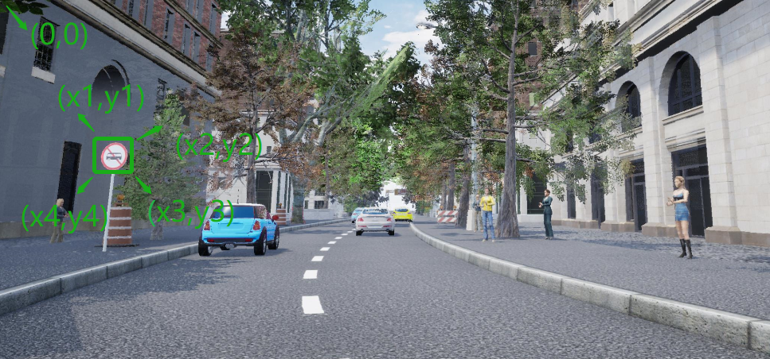
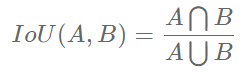
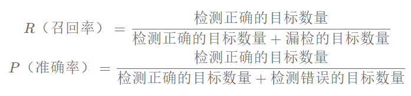
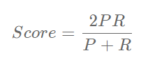

## CornerNet (CornerNet-Lite)实现基于虚拟仿真环境下的自动驾驶交通标志识别

**Xu Jing**

随着汽车产业变革的推进，自动驾驶已经成为行业新方向。如今，无论是科技巨头还是汽车厂商都在加紧布局自动驾驶，如何保障研发优势、降低投入成本，从而加快实现自动驾驶汽车商业化成为了主要焦点。作为典型的自主式智能系统，自动驾驶是集人工智能、机器学习、控制理论和电子技术等多种技术学科交叉的产物。

**虚拟仿真测试**作为一种新兴测试方法，可快速提供实车路测难以企及的测试里程并模拟任意场景，凭借“低成本、高效率、高安全性”成为验证自动驾驶技术的关键环节，根据各传感器采集到的数据信息作出精准分析和智能决策，从而提高自动驾驶汽车行驶安全性，成为自动驾驶发展过程中不可或缺的技术支撑手段。天津卡达克数据有限公司在此背景下，积极应对产业变革，依托数据资源及相关产业背景，研发智能网联汽车仿真云平台，助推自动驾驶技术快速落地。

自动驾驶系统的环境感知能力是决定仿真结果准确性的重要因素之一，天津卡达克数据有限公司在[DataFountain](https://www.datafountain.cn/)发布**基于虚拟仿真环境下的自动驾驶交通标志识别**赛题的目的旨在推动仿真环境下环境感知算法的科研水平。本数据集以虚拟仿真环境下依托视频传感器数据进行交通标志检测与识别为例，希望在全球范围内发掘和培养自动驾驶算法技术人才。

### 1.:racehorse:数据集介绍

数据来源于虚拟场景环境下自动驾驶车辆采集的道路交通数据，包括道路周边交通标志牌数据，场景中会有不同的天气状况和行人状况作为干扰因素，采用仿真环境下车辆摄像头采集数据为依靠，指导虚拟仿真环境自动驾驶技术的提升。

提供训练数据集train.csv和训练集打包文件，数据集包含两列，分别为训练数据图像文件名称和label；

提供测试数据集evaluation_private.csv和测试集打包文件，测试数据集包含两列，分别为测试图像文件名称和答案，测试数据集检测label；

提供评测数据集evaluation_public.csv和评测集打包文件，评测数据集包含一列，为评测图像文件名称；

**训练数据说明**:每一张图片，都会有标注结果文件中的（.csv）（UTF-8编码）一行。文本文件每行对应于图像中的一个四边形框，以“,”分割不同的字段，具体描述具体格式如下：

```
filename,X1,Y1,X2,Y2,X3,Y3,X4,Y4,type
```
<div align='center'>
<table>
<thead>
<tr>
<th>字段名称</th>
<th>类型</th>
<th>描述</th>
</tr>
</thead>
<tbody>
<tr>
<td>filename</td>
<td>string</td>
<td>图片名称</td>
</tr>
<tr>
<td>X1</td>
<td>int</td>
<td>左上角X坐标</td>
</tr>
<tr>
<td>Y1</td>
<td>int</td>
<td>左上角Y坐标</td>
</tr>
<tr>
<td>X2</td>
<td>int</td>
<td>右上角X坐标</td>
</tr>
<tr>
<td>Y2</td>
<td>int</td>
<td>右上角Y坐标</td>
</tr>
<tr>
<td>X3</td>
<td>int</td>
<td>右下角X坐标</td>
</tr>
<tr>
<td>Y3</td>
<td>int</td>
<td>右下角Y坐标</td>
</tr>
<tr>
<td>X4</td>
<td>int</td>
<td>左下角X坐标</td>
</tr>
<tr>
<td>Y4</td>
<td>int</td>
<td>左下角Y坐标</td>
</tr>
<tr>
<td>type</td>
<td>int</td>
<td>交通标示对应的编号(具体看下表)</td>
</tr>
</tbody>
</table>
</div>

<div align="center">
    
</div>
图片名为图片的具体名称，以左上角为零点，X1、Y1为Bounding Box左上角坐标，X2、Y2为Bounding Box右上角坐标，X3、Y3为Bounding Box右下角坐标，X4、Y4为Bounding Box左下角坐标，编码为交通标示对应的编号，如下表所示。

<div align="center">
<table>
<thead>
<tr>
<th>类型</th>
<th>对应的编号</th>
</tr>
</thead>
<tbody>
<tr>
<td>停车场</td>
<td>1</td>
</tr>
<tr>
<td>停车让行</td>
<td>2</td>
</tr>
<tr>
<td>右侧行驶</td>
<td>3</td>
</tr>
<tr>
<td>向左和向右转弯</td>
<td>4</td>
</tr>
<tr>
<td>大客车通行</td>
<td>5</td>
</tr>
<tr>
<td>左侧行驶</td>
<td>6</td>
</tr>
<tr>
<td>慢行</td>
<td>7</td>
</tr>
<tr>
<td>机动车直行和右转弯</td>
<td>8</td>
</tr>
<tr>
<td>注意行人</td>
<td>9</td>
</tr>
<tr>
<td>环岛行驶</td>
<td>10</td>
</tr>
<tr>
<td>直行和右转弯</td>
<td>11</td>
</tr>
<tr>
<td>禁止大客车通行</td>
<td>12</td>
</tr>
<tr>
<td>禁止摩托车通行</td>
<td>13</td>
</tr>
<tr>
<td>禁止机动车通行</td>
<td>14</td>
</tr>
<tr>
<td>禁止非机动车通行</td>
<td>15</td>
</tr>
<tr>
<td>禁止鸣喇叭</td>
<td>16</td>
</tr>
<tr>
<td>立交直行和转弯行驶</td>
<td>17</td>
</tr>
<tr>
<td>限制速度40公里每小时</td>
<td>18</td>
</tr>
<tr>
<td>限速30公里每小时</td>
<td>19</td>
</tr>
<tr>
<td>鸣喇叭</td>
<td>20</td>
</tr>
<tr>
<td>其他</td>
<td>0</td>
</tr>
</tbody>
</table>
</div>

**评分方式**:本次竞赛根据提交结果计算Score作为评分标准；

（1）图像检测：

图像检测需要使用矩形框将目标检测物体选中，根据用户检测结果和目标框之间重叠比率大于0.90，视为合格候选，预测的实例A和真实实例B之间的IoU (Intersection over Union)的计算公式为：

<div align="center">
    
</div>


（2）图像识别：

判断图像内容是否匹配是根据图片中汽车道路标志牌名称与候选名称是否一致。
计算作品的召回率和正确率：

计算作品的召回率（recall）和准确率（precision）：

<div align="center">
    
</div>


计算Score：

<div align="center">
    
</div>

排名：Score值越高，排名越靠前。

### 2.:sparkles:数据准备

常用的数据样式是VOC的数据格式,为了统一我们首先将上述提供的.csv数据转化为.xml,并基于VOC数据，准备训练数据为训练CornerNet做训练前的数据准备。

**1.基于VOC数据的训练数据准备**


我们修改了原CornerNet支持的COCO数据集标注的.json文件，使其支持.xml的标注及类似于VOC的标注数据和训练集准备结构，最终训练数据会存放在`<CornerNet-Lite dir>/data/`文件夹下,我们新建的数据集名称为`myData`,其文件结构如下：


```
data
└─myData
    │  说明.txt
    │
    ├─Annotations  # 标注文件
    │  ├─test
    │  ├─train
    │  └─valid
    └─JPEGImages  # 图像
        ├─test
        ├─train
        └─valid

```

**2..csv生成.xml**

将基于虚拟仿真环境下的自动驾驶交通标志识别数据集的csv标注文件转换为xml文件:

```
python3 ./data/myData/csv2xml.py
```

由于常用的标注数据均是xml或json格式的，所以这一步对于数据集的制作不是必须的。运行后在Annotations文件夹下会生成xml的标注文件。


**3.解析数据**

`<CornerNet-Lite dir>/core/dbs`下的`myData.py`,是解析数标注数据的关键脚本，这里设置了训练集的标注类别和xml文件的解析，对于训练自己的数据集你需要根据自己的数据集做相应的修改。同时在这里需要修改的还有`<CornerNet-Lite dir>/configs/CornerNet_Saccade.json`的配置文件，这里配置了系统，数据集及网络的相关超参数和默认参数的取值，在训练集的构建过程中，需要修改或创建该配置文件，其详细的配置文件的参数说明可以参考section 4的训练过程的配置文件说明。

注意：同时需要修改`<CornerNet-Lite dir>/core/dbs/__init__.py`文件:

```
from .coco import COCO
from .myData import myData

# 数据库名字
datasets = {
    "COCO": COCO,
    "myData":myData
}
```


### 3.:rocket:模型准备

我们使用CornerNet的改进网络[CornerNet-Lite](https://arxiv.org/abs/1904.08900)进行基于虚拟仿真环境下的自动驾驶交通标志识别,关于这两个AnchorFree的方法的详细介绍，可以参考<https://dataxujing.github.io/CNN-paper2/#/zh-cn/anchorfree?id=_2cornernet-detecting-objects-as-paired-keypoints>。下面我们介绍训练模型前的模型前写的准备工作，包括模型环境搭建，模型编译及测试模型编译是否成功等步骤。

**1.运行模型需要的环境**

+ Python >= 3.5
+ PyTorch 1.0.0
+ torchvision 0.2.0
+ CUDA 9.0
+ gcc 4.9.2 or above(因为Corner Pooling是C++实现的)


**2.安装依赖包**

```
# No Anaconda 
pip3 install virtualenv 
# 创建python3虚拟环境
virtualenv -p python3 CornerNet_Lite
# 进入虚拟环境
source CornerNet_Lite/bin/activate
pip3 install -r requirement.txt -i https://pypi.tuna.tsinghua.edu.cn/simple
# 退出虚拟环境
deactivate
```

```
# Anaconda
# 创建虚拟环境并安装package
conda create --name CornerNet_Lite --file conda_packagelist.txt --channel pytorch
# 开启虚拟环境
source activate CornerNet_Lite
# 退出虚拟环境
deactivate
```

**3.编译Corner Pooling层**

因为CornerNet的Corner Pooling层是通过C++实现的(GCC4.9.2 or above is required.)

```
# 这里的<CornerNet-Lite dir> 是项目的根目录
cd <CornerNet-Lite dir>/core/models/py_utils/_cpools/
python3 setup.py install --user
```

**4.编译NMS**

NMS的代码来源[Faster R-CNN](https://github.com/rbgirshick/py-faster-rcnn/blob/master/lib/nms/cpu_nms.pyx),soft-NMS的代码来源[Soft-NMS](https://github.com/bharatsingh430/soft-nms/blob/master/lib/nms/cpu_nms.pyx)
如果你对NMS,Soft-NMS,Softer-NMS不熟悉,请参考<https://dataxujing.github.io/CNN-paper2/#/>

```
cd <CornerNet-Lite dir>/core/external
make
```

> :fire: 我们在GitHub Release提供了编译好的Python3.5的虚拟环境供下载：[CornerNet_Lite](https://github.com/DataXujing/CornerNet-Lite-Pytorch/releases/tag/v1.0)


**5.下载预训练的模型**

> :fire: 这里提供了CornerNet,CornerNet-Saccade及CornerNet-Squeeze在COCO数据及上预训练的模型，供下载，GitHub Release的下载地址如下：[CornerNet-Saccade](https://github.com/DataXujing/CornerNet-Lite-Pytorch/releases/tag/v2.0)


这里我们训练的模型是CornerNet-Saccade,我们将CornerNet-Saccade的预训练模型存放在`<CornerNet-Lite dir>/cache/nnet/CornerNet_Saccade/`(注意这里的路径名使用的都是下划线！)

如果想基于其他预训练的模型做迁移学习，请将CornerNet-Squeeze的预训练模型存放在`<CornerNet-Lite dir>/cache/nnet/
CornerNet_Squeeze/` ; CornerNet预训练的模型存放在`<CornerNet-Lite dir>/cache/nnet/CornerNet/`

注意把模型路径修改为自己的模型路径

```
# CornerNet
cfg_path = get_file_path("..", "configs", "CornerNet.json")
model_path = get_file_path("..", "cache", "nnet", "CornerNet", "CornerNet_500000.pkl")

# CornerNet_Squeeze
cfg_path = get_file_path("..", "configs", "CornerNet_Squeeze.json")
model_path = get_file_path("..", "cache", "nnet", "CornerNet_Squeeze", "CornerNet_Squeeze_1000.pkl")

# CornerNet_Saccade(可下载我们预训练的模型)
cfg_path = get_file_path("..", "configs", "CornerNet_Saccade.json")
model_path = get_file_path("..", "cache", "nnet", "CornerNet_Saccade", "CornerNet_Saccade_3000.pkl")
```

> :fire: 我们也提供了基于自动驾驶的仿真数据的预训练模型的GitHub Release下载地址，可下载测试代码编译是否正常,下载地址：[CornerNet_Saccade]()

**6.运行demo.py测试模型编译是否成功**

```
python3 demo.py
```

`demo.py`使用CornerNet-Saccade测试demo.jpg，输出结果保存在demo_out.jpg,如果成功则上述模型准备环境已经完成！

注意：

1.本项目仅训练了CornerNet-Saccade，你可以调整`demo.py`测试其他的模型，比如你想训练CornerNet-Squeeze,请修改`demo.py`:

```
import cv2
from core.detectors import CornerNet_Saccade
#from core.detectors import CornerNet_Squeeze
from core.vis_utils import draw_bboxes
from core.paths import get_file_path

import os
import pickle
import pprint


detector = CornerNet_Saccade()
image    = cv2.imread("./demo.jpg")

bboxes = detector(image)
pprint.pprint(bboxes)

# 为了支持中文显示，对此做了修改
# 注意修改自己数据集的id2label字典
image  = draw_bboxes(image, bboxes)
cv2.imwrite("./demo_out.jpg", image)

```

2.修改`<CornerNet-Lite dir>/core/detectors.py`

```
from .base import Base, load_cfg, load_nnet
from .paths import get_file_path
from .config import SystemConfig
# from .dbs.coco import COCO
# from .dbs.dagm import DAGM as COCO
# 修改成自己的数据集处理
from .dbs.myData import myData as COCO
```


### 4.:construction:训练过程

训练或评估网络需要创建一个config文件，里边存放了训练或评估的超参数；除此之外还需要定义网络结构。config文件是一个JSON文件，存放在`<CornerNet-Lite dir>/configs/`下，本项目的config及参数说明如下：

<details>
<summary><mark><font color=darkred>点击查看./configs/CornerNet_Saccade.json</font></mark></summary>
<code><pre>
{
  "system": {
    "dataset": "myData",  #数据集
    "batch_size": 32,    #batch_size
    "sampling_function": "cornernet_saccade",  #数据增强策略
    "train_split": "train",      #训练集
    "val_split": "test",         #验证集
    "learning_rate": 0.00025,    #初始学习率
    "decay_rate": 10,            #学习率衰减因子
    "val_iter": 100,             #每迭代val_iter计算一次val loss
    "opt_algo": "adam",          #优化器
    "prefetch_size": 5,          #队列预取数据量
    "max_iter": 100000,          #训练迭代的总次数
    "stepsize": 200,             #训练时每迭代stepsize次学习率衰减为原来的1/decay_rate
    "snapshot": 5000,            #训练每迭代snapshot次保存一次模型参数
    "chunk_sizes": [
      32
    ]                            #每块GPU上处理的图片数，其和等于batch_size
  },
  "db": {
    "rand_scale_min": 0.5,       #随机裁减比例[0.5,0.6，0.7，...,1.1]
    "rand_scale_max": 1.1,
    "rand_scale_step": 0.1,
    "rand_scales": null,
    "rand_full_crop": true,      #随机裁剪
    "gaussian_bump": true,       #是否使用二维高斯给出惩罚减少量
    "gaussian_iou": 0.5, #高斯半径的大小根据object尺寸得到,bounding box和gt box至少0.5IoU
    "min_scale": 16,
    "view_sizes": [],
    "height_mult": 31,
    "width_mult": 31,
    "input_size": [
      255,
      255
    ],             #网络输入图片的size
    "output_sizes": [
      [
        64,
        64
      ]
    ],             #网络输出图片的size
    "att_max_crops": 30,  #和attention map相关的参数设置
    "att_scales": [
      [
        1,
        2,
        4
      ]
    ],
    "att_thresholds": [
      0.3
    ],             #概率>0.3的location被筛出来
    "top_k": 12,   #maximum number of crops to process
    "num_dets": 12,
    "categories": 10,     #类别数
    "ae_threshold": 0.3,  #测试时，仅处理attention maps上 score > as_threshold=0.3 的locations
    "nms_threshold": 0.5, #nms的阈值
    "max_per_image": 100  #maximum number of objects to predict on a single image
  }
}
</code></pre>
</details>


每一个config文件对应一个相关的模型文件，存放在`<CornerNet-Lite dir>/core/models/`下，也就是说，如果我们是用`<CornerNet-Lite dir>/configs/`下的`<model>.json`config文件，就应该有一个存放在`<CornerNet-Lite dir>/core/models/`下的`<model>.py`

<details>
<summary><mark><font color=darkred>点击查看./models/CornerNet_Saccade.py</font></mark></summary>
<code><pre>
import torch
import torch.nn as nn
from .py_utils import TopPool, BottomPool, LeftPool, RightPool
from .py_utils.utils import convolution, residual, corner_pool
from .py_utils.losses import CornerNet_Saccade_Loss
from .py_utils.modules import saccade_net, saccade_module, saccade
def make_pool_layer(dim):
    return nn.Sequential()
def make_hg_layer(inp_dim, out_dim, modules):
    layers = [residual(inp_dim, out_dim, stride=2)]
    layers += [residual(out_dim, out_dim) for _ in range(1, modules)]
    return nn.Sequential(*layers)
class model(saccade_net):
    def _pred_mod(self, dim):
        return nn.Sequential(
            convolution(3, 256, 256, with_bn=False),
            nn.Conv2d(256, dim, (1, 1))
        )
    def _merge_mod(self):
        return nn.Sequential(
            nn.Conv2d(256, 256, (1, 1), bias=False),
            nn.BatchNorm2d(256)
        )
    def __init__(self):
        stacks = 3
        pre = nn.Sequential(
            convolution(7, 3, 128, stride=2),
            residual(128, 256, stride=2)
        )
        hg_mods = nn.ModuleList([
            saccade_module(
                3, [256, 384, 384, 512], [1, 1, 1, 1],
                make_pool_layer=make_pool_layer,
                make_hg_layer=make_hg_layer
            ) for _ in range(stacks)
        ])
        cnvs = nn.ModuleList([convolution(3, 256, 256) for _ in range(stacks)])
        inters = nn.ModuleList([residual(256, 256) for _ in range(stacks - 1)])
        cnvs_ = nn.ModuleList([self._merge_mod() for _ in range(stacks - 1)])
        inters_ = nn.ModuleList([self._merge_mod() for _ in range(stacks - 1)])
        att_mods = nn.ModuleList([
            nn.ModuleList([
                nn.Sequential(
                    convolution(3, 384, 256, with_bn=False),
                    nn.Conv2d(256, 1, (1, 1))
                ),
                nn.Sequential(
                    convolution(3, 384, 256, with_bn=False),
                    nn.Conv2d(256, 1, (1, 1))
                ),
                nn.Sequential(
                    convolution(3, 256, 256, with_bn=False),
                    nn.Conv2d(256, 1, (1, 1))
                )
            ]) for _ in range(stacks)
        ])
        for att_mod in att_mods:
            for att in att_mod:
                torch.nn.init.constant_(att[-1].bias, -2.19)
        hgs = saccade(pre, hg_mods, cnvs, inters, cnvs_, inters_)
        tl_modules = nn.ModuleList([corner_pool(256, TopPool, LeftPool) for _ in range(stacks)])
        br_modules = nn.ModuleList([corner_pool(256, BottomPool, RightPool) for _ in range(stacks)])
        #这路需要修改为自己的类别数，我们这里是21个类别！！！
        tl_heats = nn.ModuleList([self._pred_mod(21) for _ in range(stacks)])
        br_heats = nn.ModuleList([self._pred_mod(21) for _ in range(stacks)])
        for tl_heat, br_heat in zip(tl_heats, br_heats):
            torch.nn.init.constant_(tl_heat[-1].bias, -2.19)
            torch.nn.init.constant_(br_heat[-1].bias, -2.19)
        tl_tags = nn.ModuleList([self._pred_mod(1) for _ in range(stacks)])
        br_tags = nn.ModuleList([self._pred_mod(1) for _ in range(stacks)])
        tl_offs = nn.ModuleList([self._pred_mod(2) for _ in range(stacks)])
        br_offs = nn.ModuleList([self._pred_mod(2) for _ in range(stacks)])
        super(model, self).__init__(
            hgs, tl_modules, br_modules, tl_heats, br_heats,
            tl_tags, br_tags, tl_offs, br_offs, att_mods
        )
        self.loss = CornerNet_Saccade_Loss(pull_weight=1e-1, push_weight=1e-1)
</code></pre>
</details>


训练模型：

```
source ./CornerNet_Lite/bin/activate
python3 trainmyData.py <model>
```

例如训练CornerNet-Saccade:

```
python3 trainmyData.py CornerNet_Saccade
```
注意要根据自己的硬件条件和数据集提前调整`CornerNet_Saccade.json`


### 5.:chart_with_upwards_trend:网络推断过程

网络推断:

```
python3 evaluatemyData.py <model> --testiter <iter> --split <split>

# example
python3 evaluatemyData.py CornerNet_Saccade --testiter 30000 --split valid
```

注意要修改`<CornerNet-Lite dir>/core/test/CornerNet_Saccade.py`文件，如果想使用全新的配置文件而不是训练的配置文件进行推断，可以创建一个带有后缀的配置文件（比如：`<model>-<suffix>.json`),此时不需要重新创建`<model>-<suffix>.py`文件。

使用新的config文件：

```
python3 evaluatemyData.py <model> --testiter <iter> --split <split> --suffix <suffix>
```

使用multi-scale配置文件:

```
python3 evaluatemyData.py CornerNet --testiter <iter> --split <split> --suffix multi_scale
```

### 6.:whale:Demo

<!-- **TODO** -->


*训练迭代次数较少，效果并不好*

### 7.:tada:致谢

Name | Link |  
:-|:-|
:white_check_mark:Princeton Vision & Learning Lab| <https://github.com/princeton-vl>
:white_check_mark:知乎大佬: 张佳程 | <https://zhuanlan.zhihu.com/p/84528447> 
:white_check_mark:takooctopus | <https://github.com/takooctopus/CornerNet-Lite-Tako> 
:white_check_mark:天津泰达科技发展集团有限公司 | <https://www.datafountain.cn/competitions/339> 
:white_check_mark:huangzicheng| <https://github.com/huangzicheng/CornerNet-Lite> 